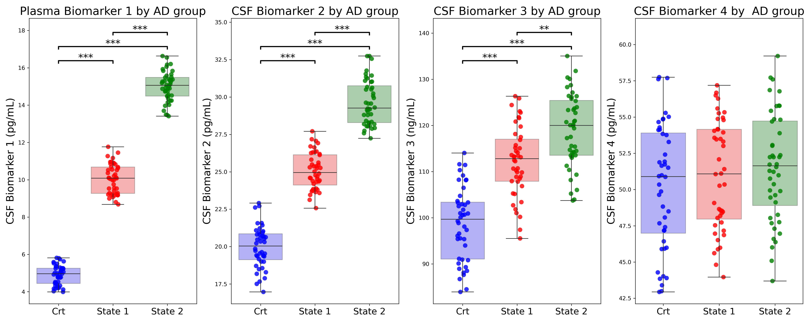

# Customizable boxplots with statistical significance bars 📊

## Overview

This repository provides a Python tool for creating **customizable boxplots with statistical significance bars** that are ready for **paper presentation**. It supports multiple p-value correction methods (Bonferroni, FDR), customizable interquartile ranges, and color palettes for better visualization of statistical comparisons.  
**Now supports automatic selection of statistical tests based on group count and normality:**
- For 2 groups: t-test (if normal) or Mann-Whitney U (if not)
- For 3+ groups: ANOVA (if all groups normal) or Kruskal-Wallis (if not), with pairwise post-hoc tests


## Features

📌 Statistical significance bars with corrected p-values

🎨 Customizable boxplots (colors, labels, and layouts)

🔬 Supports multiple p-value corrections (Bonferroni, FDR, etc.) from [statsmodels.stats.multitest.multipletests](https://www.statsmodels.org/dev/generated/statsmodels.stats.multitest.multipletests.html) library 

📊 Ideal for biomarker analysis and research visualization

## Statistical Methods

- **p-value correction:** The function uses the `multipletests` method from the `statsmodels.stats.multitest` library for multiple testing correction. To modify the correction method, ensure that it is one of the methods implemented in `multipletests`.
- **Statistical tests:**  
  - **2 groups:**  
    - If both groups are normal (Shapiro-Wilk (n < 50)/Anderson test (n> 50)), a **t-test** (`ttest_ind`) is performed.  
    - If not, a **Mann-Whitney U test** (`mannwhitneyu`) is used.
  - **3 or more groups:**  
    - If all groups are normal, an **ANOVA** (`f_oneway`) is performed.  
    - If not, a **Kruskal-Wallis test** (`kruskal`) is used.  
    - For pairwise comparisons, t-test or Mann-Whitney U is chosen based on normality for each pair.

## Installation
```pip install git+https://github.com/mafaves/advanced_boxplot_viz.git```

## Usage
An example of usage can be seen in the Jupyter notebook [`./example/run.ipynb`](./example/run.ipynb)

## Parameters explained

**df (DataFrame):** The input dataset containing biomarker values.

**group_col (str):** The column in df that defines groups for comparison.

**biomarker_list (list of str):** List of biomarker column names to analyze.

**palette (dict):** A dictionary mapping group labels to colors.

**subplots_x (int, default=1):** Number of rows in the subplot grid.

**subplots_y (int, default=2):** Number of columns in the subplot grid.

**fig_size (tuple, default=(10,6)):** Figure size in inches.

**xtick_labels (list, default=["Control", "Disease"]):** Labels for the x-axis.

**image_name (str, default="plot.png"):** Filename for saving the generated plot.

**bar_height_factor (float, default=0.05):** Height factor for significance bars.

**bar_tips_factor (float, default=0.01):** Reduction factor for bar tips.

**y_top_factor (float, default=0.1):** Scaling factor to adjust y-axis top margin.

**y_range_factor (float, default=0.15):** Scaling factor to adjust y-axis range.

**asterisk_factor (float, default=0.02):** Offset factor for asterisk positioning.

**title (bool, default=True)** Whether to display titles for each biomarker plot.

**biomarker_title_names (dict, optional)** Custom titles for biomarkers.

**y_labels (bool, default=True)** Whether to display y-axis labels.

**biomarker_y_label_names (dict, optional)** Custom y-axis labels for biomarkers.

**correction_method (str, default="fdr_bh")** Method for p-value correction (e.g., "bonferroni", "fdr_bh").

**iqr_min (float, optional)** Lower bound for interquartile range filtering.

**iqr_max (float, optional)** Upper bound for interquartile range filtering.

**jitter_size (float, optional)** Size of jitter points in the strip plot.

**alpha (float, optional)** Transparency level for strip plot points.

**showfliers (bool, optional)** Whether to display outliers in the boxplot.

**omnibus results** Results of omnibus test when the numbers of groups > 2

## Output example


## Acknowledgment

This code is modified from the original implementation found at [Boxplots with Significance Bars](https://rowannicholls.github.io/python/graphs/ax_based/boxplots_significance.html)


