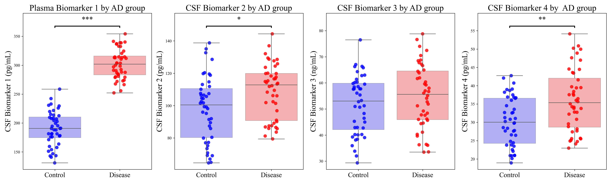

# Customizable boxplots with statistical significance bars 📊

## Overview

This repository provides a Python tool for creating **customizable boxplots with statistical significance bars** that are ready for **paper presentation**. It supports multiple p-value correction methods (Bonferroni, FDR), customizable interquartile ranges, and color palettes for better visualization of statistical comparisons.

## Features

📌 Statistical significance bars with corrected p-values

🎨 Customizable boxplots (colors, labels, and layouts)

🔬 Supports multiple p-value corrections (Bonferroni, FDR, etc.) from [statsmodels.stats.multitest.multipletests](https://www.statsmodels.org/dev/generated/statsmodels.stats.multitest.multipletests.html) library 

📊 Ideal for biomarker analysis and research visualization

## Statistical Methods

- **p-value correction:** The function uses the `multipletests` method from the `statsmodels.stats.multitest` library for multiple testing correction. To modify the correction method, ensure that it is one of the methods implemented in `multipletests`.  
- **Statistical test:** The function performs a **t-test** (`ttest_ind`) to compare groups. If you wish to change the test, modify the following line in the code:  

  ```python
  _, p_value = ttest_ind(group1, group2, equal_var=True)

## Usage
```
import pandas as pd
from boxplot_significance import generate_boxplots_with_significance

# Load example data
df = pd.read_csv("example_data.csv")

biomarker_title_names = {
    "Biomarker_1": "Plasma Biomarker 1 by AD group",
    "Biomarker_2": "CSF Biomarker 2 by AD group",
    "Biomarker_3": "CSF Biomarker 3 by AD group",
    "Biomarker_4": "CSF Biomarker 4 by  AD group",
}

biomarker_y_axis_names = {
    "Biomarker_1": "CSF Biomarker 1 (pg/mL)",
    "Biomarker_2": "CSF Biomarker 2 (pg/mL)",
    "Biomarker_3": "CSF Biomarker 3 (ng/mL)",
    "Biomarker_4": "CSF Biomarker 4 (pg/mL)",

}

# Define parameters
group_col = "nAD"  # Column indicating group classification (0 = Control, 1 = Disease)
biomarker_list = ["Biomarker_1", "Biomarker_2", "Biomarker_3", "Biomarker_4"]  # List of biomarkers to analyze
palette = {0: 'blue', 1: 'red'}  # Dictionary mapping group labels to colors
subplots_x = 1  # Number of rows in the subplot grid
subplots_y = 5  # Number of columns in the subplot grid
fig_size = (20, 6)  # Size of the figure (width, height) in inches
xtick_labels = ["Control", "Disease"]  # Labels for x-axis groups
image_name = "boxplots.png"  # Filename for saving the generated boxplots
bar_height_factor = 0.05  # Distance left between significance bars 
bar_tips_factor = 0.01  # Length of the horizontal tips of significance bars 
y_top_factor = 0.01  # Height of significance bars above the end of the violin plots 
y_range_factor = 0.15  # Extra space added above the figure 
asterisk_factor = 0.02  # Height of the asterisks above the significance bar 

generate_boxplots_with_significance(df, group_col, biomarker_list, palette, biomarker_title_names, biomarker_y_axis_names,
                                      subplots_x, subplots_y, fig_size,
                                      xtick_labels, image_name,
                                      bar_height_factor, bar_tips_factor,
                                      y_top_factor, y_range_factor, asterisk_factor,
                                      title= True, y_labels = True, correction_method= "fdr_bh", 
                                      iqr_min= 0.05, iqr_max= 0.95, jitter_size = 8, alpha = 0.8, showfliers= False)
```

## Parameters explained

**df (DataFrame):** The input dataset containing biomarker values.

**group_col (str):** The column in df that defines groups for comparison.

**biomarker_list (list of str):** List of biomarker column names to analyze.

**palette (dict):** A dictionary mapping group labels to colors.

**subplots_x (int, default=1):** Number of rows in the subplot grid.

**subplots_y (int, default=2):** Number of columns in the subplot grid.

**fig_size (tuple, default=(10,6)):** Figure size in inches.

**xtick_labels (list, default=["Control", "Disease"]):** Labels for the x-axis.

**image_name (str, default="plot.png"):** Filename for saving the generated plot.

**bar_height_factor (float, default=0.05):** Height factor for significance bars.

**bar_tips_factor (float, default=0.01):** Reduction factor for bar tips.

**y_top_factor (float, default=0.1):** Scaling factor to adjust y-axis top margin.

**y_range_factor (float, default=0.15):** Scaling factor to adjust y-axis range.

**asterisk_factor (float, default=0.02):** Offset factor for asterisk positioning.

**title (bool, default=True)** Whether to display titles for each biomarker plot.

**biomarker_title_names (dict, optional)** Custom titles for biomarkers.

**y_labels (bool, default=True)** Whether to display y-axis labels.

**biomarker_y_label_names (dict, optional)** Custom y-axis labels for biomarkers.

**correction_method (str, default="fdr_bh")** Method for p-value correction (e.g., "bonferroni", "fdr_bh").

**iqr_min (float, optional)** Lower bound for interquartile range filtering.

**iqr_max (float, optional)** Upper bound for interquartile range filtering.

**jitter_size (float, optional)** Size of jitter points in the strip plot.

**alpha (float, optional)** Transparency level for strip plot points.

**showfliers (bool, optional)** Whether to display outliers in the boxplot.

## Output example


## Acknowledgment

This code is modified from the original implementation found at [Boxplots with Significance Bars](https://rowannicholls.github.io/python/graphs/ax_based/boxplots_significance.html)


